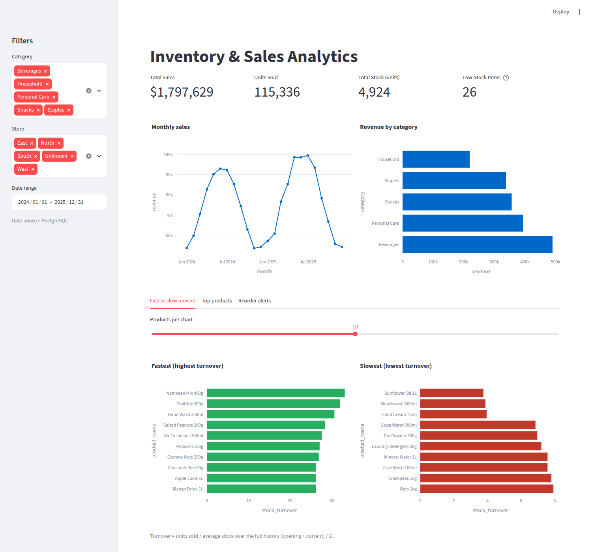

# Inventory & Sales Analytics

[](https://github.com/sanchitjha/data-analysis/actions)

End-to-end inventory & sales analytics for a retail/warehouse business: which items sell fast, which sit on the shelf, and what needs
reordering now. A tested ETL pipeline loads PostgreSQL, a Streamlit dashboard and Power BI model sit on top, and reorder alerts go out via Slack/email.

**Stack:** Python (Pandas, SQLAlchemy) · PostgreSQL · SQL views · Streamlit/Plotly · Power BI (DAX/TMDL) · Excel · Docker · GitHub Actions



## Architecture
```
data/raw/*.csv ──► clean (Pandas) ──► validate (quality gate) ──► data/clean/*.csv
 synthetic sim                                   │                     │
 or Kaggle adapter                               ▼                     ▼
                                     PostgreSQL (tables + views) ──► Power BI (PBIP/DAX)
                                          │                        ──► Excel summary
                                          ├──► Streamlit dashboard
                                          └──► reorder alerts (Slack / email)
```
| Path | Purpose |
|---|---|
| `src/invsales/` | `simulate`, `sources` (synthetic + Kaggle adapter), `clean`, `validate`, `db`, `kpis`, `alerts`, `pipeline`, `cli` |
| `sql/` | `01_schema` · `02_load_data` (psql `\copy`) · `03_analysis_queries` · `04_views` (reporting views) |
| `app/streamlit_app.py` | Interactive dashboard: KPI cards, trend, category, fast/slow movers, top products, reorder table, filters |
| `powerbi/` | `Inventory.pbip` (generated TMDL model), `measures.dax`, `BUILD_GUIDE.md`, model CSVs |
| `excel/` | Workbook: data table + SUMIFS summaries + chart + reorder flags |
| `tests/` | 27 tests: cleaning, validation, KPIs, simulation, Kaggle adapter, alerts, **SQL-vs-pandas integration on real PostgreSQL** |
| `notebooks/` | Exploratory notebook (cleaning + EDA walk-through) |
| `Dockerfile`, `docker-compose.yml`, `.github/workflows/ci.yml` | Packaging and CI |

## About the data (please read)
- **Default: synthetic.** `invsales generate` simulates 60 products in 5 categories over 2 years (~62k order lines): demand with seasonality/trend/weekends,
  a reorder-point policy with supplier lead times, restocks, and 7 products hit by a supplier outage. Then it corrupts the export the way real ones are
  (duplicates, missing values, 3 date formats, `$` prices, inconsistent category casing) so the cleaning step is real. Seeded and reproducible.
- **Real sales (optional): Kaggle.** `invsales kaggle` downloads *Store Item Demand Forecasting* and maps it to the same schema. Real: dates, stores,
  items, units sold. **Not in that dataset and therefore derived:** product names/categories, prices, costs, lead times, and the entire inventory layer
  (stock, reorder levels, restocks), simulated on top of the real demand. Needs `KAGGLE_USERNAME`/`KAGGLE_KEY` and accepting the competition rules;
  the adapter is unit-tested on a same-schema fixture but has **not been run against the real download**.
- No public dataset ships true stock levels for a specific business; describe the inventory layer as simulated when discussing the project.

## Quick start
```bash
# Option A - Docker (PostgreSQL + ETL + dashboard):
docker compose up --build            # dashboard at http://localhost:8501
docker compose run --rm alerts       # dry-run reorder alert (add --send after configuring .env)

# Option B - local
pip install -e ".[dashboard,dev]"
cp .env.example .env                 # set DATABASE_URL etc.
invsales all                         # generate -> clean -> validate -> load PostgreSQL
streamlit run app/streamlit_app.py   # falls back to data/clean CSVs if PostgreSQL is unreachable
invsales alerts                      # dry run;  invsales alerts --send  to post to Slack / email
pytest                               # the DB integration tests auto-skip if PostgreSQL is not reachable
```
`invsales kaggle [--train-csv path] [--items N]` then `invsales etl` switches the source to Kaggle data.
Compose uses development credentials (`inventory/inventory`); set `POSTGRES_PASSWORD` for anything shared.

## Pipeline behaviour
- **Cleaning rules** (`clean.py`): parse 3 date formats; strip currency symbols; dedupe by `order_id` keeping the most complete row; fill missing prices from the product master;
  missing store → `Unknown`; drop rows with missing/≤0 quantity or unknown product; normalise category text.
  Counts are written to `data/clean/cleaning_report.json` (default seed: 748 duplicates removed, 621 prices filled, 367 invalid rows dropped).
- **Quality gate** (`validate.py`): unique keys, no nulls, positive quantities/prices, price > cost, no negative stock, referential integrity, revenue = qty × price.
  Any failure aborts the ETL before anything is written or loaded.
- **Load** (`db.py`): schema recreate + load + views in **one transaction** → re-runs are idempotent and readers never see a half-load.
- **Alerts** (`alerts.py`): severity Stockout / Critical (≤3 days left) / Low, ranked by urgency; Slack webhook and/or SMTP; dry-run unless `--send`.

## KPI definitions
- **Stock turnover** = units sold ÷ average stock, average stock = (opening stock + current stock) ÷ 2
- **Days of inventory** = days selling ÷ turnover · **Fast/Slow** = top/bottom quartile of turnover (`NTILE(4)`)
- **Reorder alert** = `current_stock <= reorder_level`, plus days of stock left at the last-90-day sales rate

## Results with the default data (seed 42)
- Total sales **$1.79M**, 115k units, gross margin ≈ 30%; Beverages lead (27% of revenue) with a summer peak and a Q4 trough
- Stock turnover ranges from ~3.3× (Soda Water, Laundry Detergent, Sunflower Oil: overstocked) to ~24× (Trail Mix, Popcorn, Salt)
- **13 of 60 products are at/below reorder level, 4 are out of stock**
- These are properties of the simulation, not real-world findings.

## Power BI and Excel
- `powerbi/Inventory.pbip` is generated by `scripts/build_pbip.py`; it was **not opened in Power BI Desktop** while building this repo. See `powerbi/BUILD_GUIDE.md`
  (fast path + manual fallback). Add your own `.pbix` and screenshots once you have built the report.
- `excel/Inventory_Sales_Summary.xlsx` uses SUMIFS summaries (openpyxl cannot author real PivotTables); insert a PivotTable on the `SalesData` table to add one.
  Formulas were not recalculated in Excel by the generator; check the totals on first open.

## Development
`make test` · `make lint` · CI runs ruff + pytest (with a PostgreSQL service) + an end-to-end ETL and a Docker build.
`docker-compose.yml` and the Dockerfile have not been executed in the authoring environment (no Docker daemon); CI builds the image.
